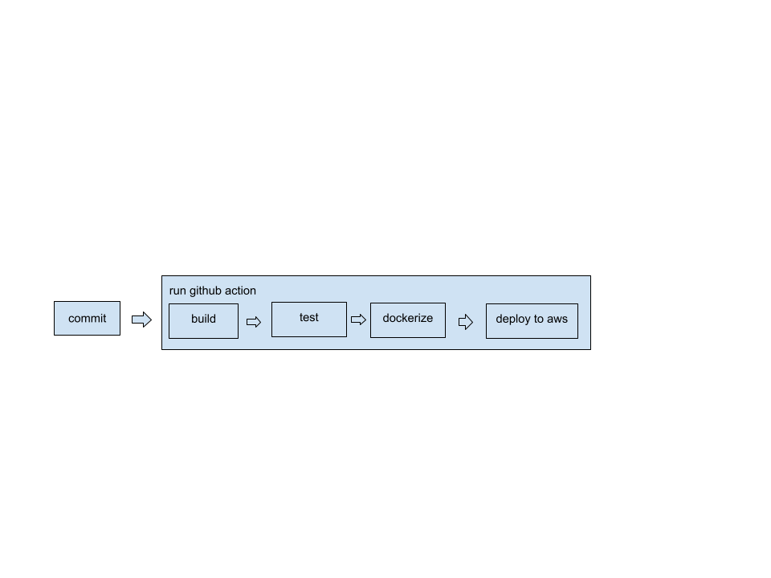

# to-do List

We will Use TDD approach.

There are two applications, a server and a client. Both applications are hosted on Aws instance with kubernates. The hosting process is as below.

    1- The developer pushes her/his changes to the github repository
    2- Running github actions
        a- Dockerize
            -Build and test run in dockerfile
            -Creating docker image
            -Upload to docher hub
        b- Deployment
            -Connecting the aws instance
            -Running minikube commands and deploying docker image from hub

Used technologies;

    Version control system: Git.
    Ui: React, nodejs, webpack, cypress 
    BackEnd: Golang
    Database: in-memory
    Hosting: Aws instance
    Deployment: Git actions
    Kubernates Deployment: Aws instance, docker hub

You can access docker containers from the docker hub:

    docker pull bolatahmett/todo_client:latest
    docker pull bolatahmett/todo_server:latest

Usefull links:

    https://docs.docker.com/engine/install/ubuntu/
    https://minikube.sigs.k8s.io/docs/start/
    https://www.section.io/engineering-education/build-and-dockerize-a-full-stack-react-app-with-nodejs-and-nginx/
    https://learntdd.in/react/
    https://golang.org/doc/tutorial/web-service-gin
    https://docs.docker.com/ci-cd/github-actions/
    https://farhan-tanvir.medium.com/ci-cd-from-github-to-aws-ec2-using-github-action-e18b621c0507

Pipeline:

